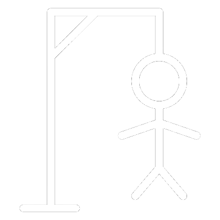

# Spaceman Game

A simple game to add excitment and challgene in your way to guess random words! 

Add a game screenshot --> In the assets folder



## Getting Started 

### Play the Game
[Deployed Game](https://3sfoor102.github.io/spaceman-game/)

### How to Play
1. Click on letter to start your attempts 
2. C


5. Click Restart 


### Installation 
No Installation required! Simply clone the repo to your machine and open the `index.html` in your browser 

```bash
git clone
cd memory
open index.html
```

### Technologies Used 
- HTML
- CSS
- JavaScript

### Future Enhancments 
- Adding more levels 
- Enhancing design
- Adding side challenges
- Adding points/score
  

### Credits
- Thanks to my GA instructor, and to my GA instructors associates 